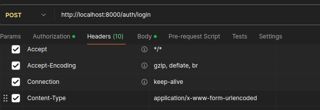
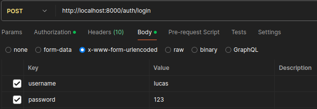

<!-- fastapi, uvicorn, sqlalchemy, pymysql, cryptography, python-multipart, passlib, python-jose, bcrypt -->

# Pasos para correr la API

1. Crear y activar entorno virtual
   
``` pip install virtualenv ```

``` python -m virtualenv miEntorno1 ```

```.\miEntorno1\bin\activate```

Y lo dejan predeterminado para que se abra en cada terminal del vscode en el directorio:

F1, Select Python Interpreter, y seleccionan el python dentro de venv.

A partir de ahora, todos los comandos se ejecutan dentro del entorno virtual

2. pip install requirements.txt / si no funciona, instalar nombres de las librerias directamente (comentario en la primera línea)

3. crean db en mysql llamada pocho_sports, credenciales (user: root, password: )

4. corren la api con uvicorn main:app

# Endpoints

## POST create user

http://localhost:8000/auth/register

Ejemplo:

```
{
    "username":"lucas",
    "email":"lucas@gmail.com",
    "password":"123",
    "first_name": "Lucas",
    "last_name":"Garaglia",
    "role":"client",
    "country": "Argentina",
    "province": "Provincia de Buenos Aires",
    "party":"Villa Adelina",
    "locality":"Boulogne",
    "address":"Batalla la Florida 1256"
}
```

## POST login

http://localhost:8000/auth/login

Los datos del login no se pasan por json. Muestro como se pasan en el postman, despues ajustalo al frontend: 





## GET get current user

http://localhost:8000/users/me con el bearer

## POST make order --> actualiza stock

http://localhost:8000/order

Se pasa un array de products con el id del product y la cantidad que se va a comprar.

Ejemplo:

```
{
  "products": [
    {
      "product_id": 1,
      "quantity": 2
    },
    {
      "product_id": 2,
      "quantity": 5
    }
  ]
}
```

## POST create product

http://localhost:8000/products

Ejemplo:

```
{
  "name": "Pelota de futbol",
  "description": "De goma",
  "price": 25000,
  "stock": 100,
  "code": "PELOTA001",
  "category": "Pelotas"
}
```

## GET get all products

http://localhost:8000/products

## GET get specific product

http://localhost:8000/products/2

## PUT update product

http://localhost:8000/products/1

Ejemplo:

```
{
  "name": "Pelota de RUGBY UPDATED",
  "description": "De goma",
  "price": 25000,
  "stock": 100,
  "code": "PELOTA001",
  "category": "Pelotas"
}
```

## DELETE delete product

http://localhost:8000/products/1

## PUT edit sale status

http://localhost:8000/sales/1

Ejemplo:

```
{
    "status":"Sent"
}
```

## GET get all orders

http://localhost:8000/orders
